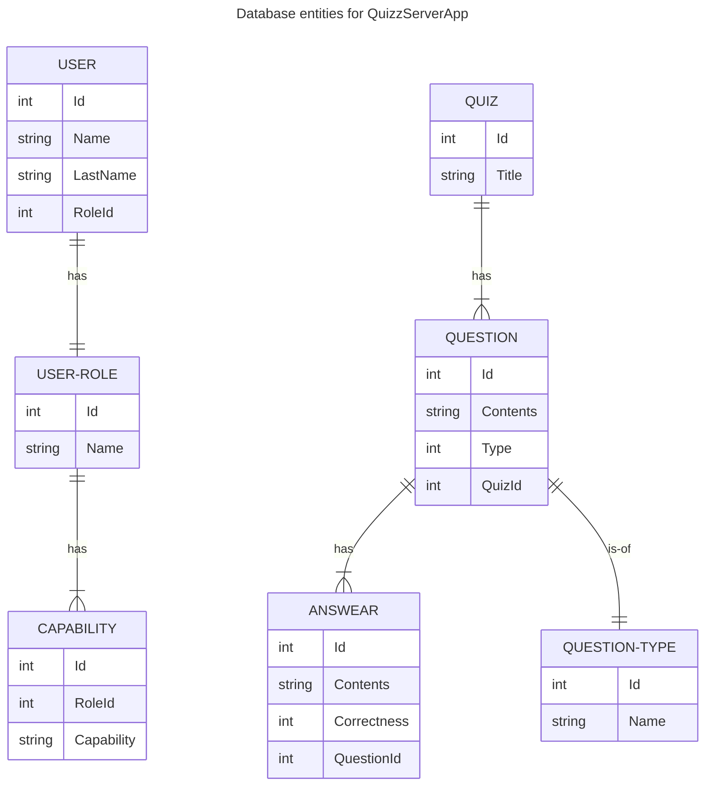

```mermaid
---
title: Database entities for QuizzServerApp
---
erDiagram
    USER ||--|| USER-ROLE : has
    USER {
        int Id
        string Name
        string LastName
        int RoleId
    }

    USER-ROLE ||--|{ CAPABILITY : has
    USER-ROLE {
        int Id
        string Name
    }

    CAPABILITY {
        int Id
        int RoleId
        string Capability
    }


    QUIZ ||--|{ QUESTION : has
    QUIZ {
        int Id
        string Title
    }

    QUESTION ||--|{ ANSWEAR : has
    QUESTION ||--|| QUESTION-TYPE : is-of
    QUESTION {
        int Id
        string Contents
        int Type
        int QuizId
    }

    QUESTION-TYPE {
        int Id
        string Name
    }

    ANSWEAR {
        int Id
        string Contents
        int Correctness
        int QuestionId
    }

```