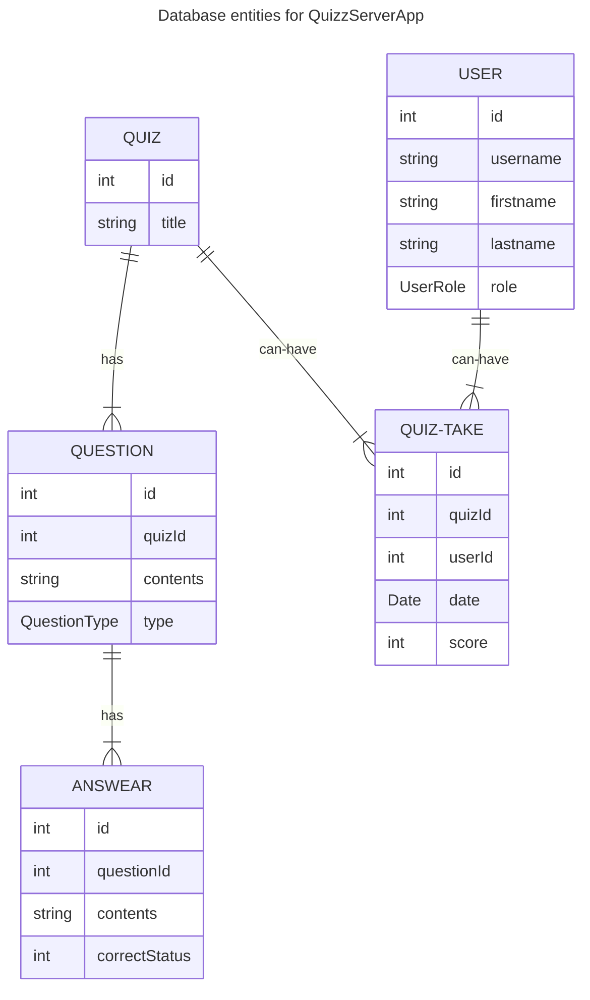

```mermaid
---
title: Database entities for QuizzServerApp
---
erDiagram
    USER {
        int id
        string username
        string firstname
        string lastname
        UserRole role
    }


    QUIZ ||--|{ QUESTION : has
    QUIZ {
        int id
        string title
    }

    QUESTION ||--|{ ANSWEAR : has
    QUESTION {
        int id
        int quizId
        string contents
        QuestionType type
    }

    ANSWEAR {
        int id
        int questionId
        string contents
        int correctStatus
    }

    QUIZ-TAKE {
        int id
        int quizId
        int userId
        Date date
        int score
    }
    USER ||--|{ QUIZ-TAKE : can-have
    QUIZ ||--|{ QUIZ-TAKE : can-have

```